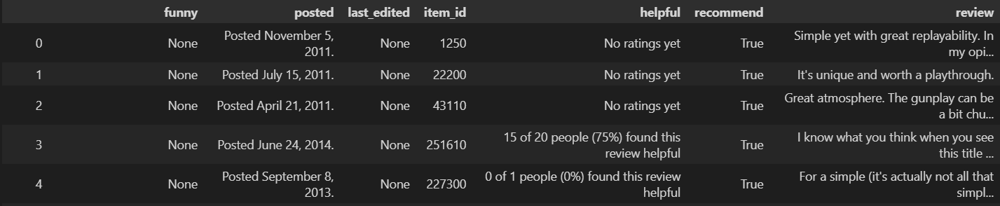
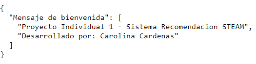
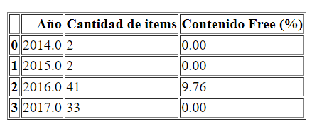
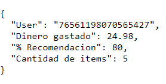
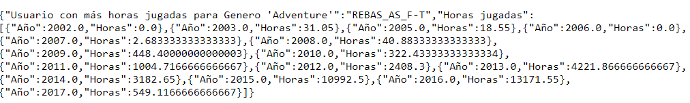
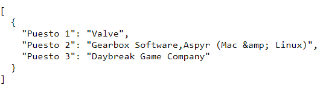
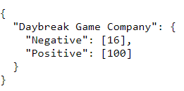
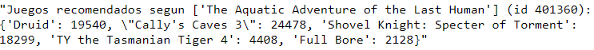

<h1 align='center'>
<b>Proyecto Individual 1 - Sistema de Recomendacion de STEAM</b>
</h1>

## Descripcion General
En este proyecto se desarrolló un sistema de recomendación para Steam, una plataforma multinacional de videojuegos. Debido al estado de los datos entregados se debió realizar un proceso de limpieza y adecuación de los datos para que aportaran información apropiada para el modelo a desarrollar. 

## Descripción de la Estructura de Datos

### Datos en bruto
Los datos empleados para la realizacion de este proyecto fueron extraidos del [Repositorio PI01 - Soy Henry](https://github.com/soyHenry/PI_ML_OPS/tree/FT). A continuacion se describen los archivos en bruto.

#### **Games**
Es el archivo en el que se encuentra toda la informacion relacionada con el contenido que se ofrece en la plataforma STEAM. <br>


1. **publisher** - string <br> &emsp; Empresa publicadora del contenido
2. **genres** - list <br> &emsp; Genero del contenido
3. **app_name** - string <br> &emsp; Nombre del contenido
4. **title** - string <br> &emsp; Titulo del contenido
6. **url** - string <br> &emsp; URL de publicacion del contenido
7. **release_date** - string <br> &emsp; Fecha de lanzamiento
8. **tags** - list <br> &emsp; Etiquetas del contenido
9. **reviews_url** - string <br> &emsp; URL de las reviews del contenido
10. **specs** - list <br> &emsp; Especificaciones del contenido
11. **price** - string <br> &emsp; Precio del contenido
12. **early_access** - float <br> &emsp; Acceso temprano al contenido
13. **id** - float <br> &emsp; Identificador unico del contenido
14. **developer** - string <br> &emsp; Desarrollador del contenido

#### **Reviews**
Este archivo contiene las reseñas realizadas por cada usuario de la plataforma. <br>


1. **user_id** - string <br> &emsp; Identificador unico del usuario
2. **user_url** - string <br> &emsp; URL del perfil del usuario
3. **reviews** - string <br> &emsp; Reviews del usuario en formato JSON. Contenia los siguientes datos: <br>


    - **funny** - string <br> 
    - **posted** - string <br> Fecha de publicacion
    - **last_edited** - string <br> &emsp; Ultima fecha de edicion
    - **item_id** - string <br> &emsp; Identificador unico del contenido
    - **helpful** - string <br> Indicador de si la reseña del usuario fue util
    - **recommend** - string <br> &emsp; Indicador de si el contenido fue recomendado por el usuario
    - **review** - string <br> &emsp; Reseña escrita por el usuario

#### **Items**
En este archivo se encuentran el contenido que ha adquirido cada usuario y el tiempo de juego para cada uno. <br>

<p align="center">
  
</p>

1. **user_id** - string <br> Identificador unico del usuario
2. **items_count** - int <br> Cantidad de contenido adquirido por el usuario
3. **steam_id** - string <br> Identificador unico del usuario en la plataforma
4. **user_url** - string <br> URL del perfil del usuario
5. **items** - string <br> Contenido adquirido por el usuario en formato JSON. Contenia los siguientes datos:
Diccionario anidado con los items de cada usuario. Contenia los siguientes datos:


    - **item_id** - string <br> Identificador unico del contenido
    - **item_name** - string <br> Nombre del contenido
    - **playtime_forever** - float <br> Tiempo de juego acumulado por el usuario
    - **playtime_2weeks** - float <br> Tiempo de juego del usuario en las ultimas 2 semanas

### DataFrames finales

#### **Games**
<p align="center">
  
</p>

Las columnas nuevas del DataFrame son:
- **item_name** que corresponde a la columna *app_name*
- **item_id** que corresponde a la columna *id*
- **release_year** es el año de lanzamiento extraido de *release_date*


#### **Reviews**
<p align="center">
  
</p>

Las columnas nuevas del DataFrame son:
- **item_name** es el nombre del contenido
- **sentiment_analysis** que corresponde a un analisis de sentimiento de la columna *review*
- **words** son las palabras principales extraidas de la columna *review*
- **word_count** es el numero de palabras de la columna *review*

#### **Items**
<p align="center">
  
</p>
En este DataFrame no se adicionaron columnas, **playtime** corresponde a la columna *playtime_forever* convertido a horas.

## Estructura del Proyecto

### Carpetas

- **[Archivos API:](Archivos%20API)** Contiene los archivos procesados y adaptados segun los requerimientos de cada funcion. Son los archivos que se cargan en las funciones del main.py y el main.ipynb
- **[Archivos EDA:](Archivos%20EDA)** Contiene los archivos resultantes del notebook EDA. Son los archivos que se cargan en el notebook Archivos_API.ipynb para crear los archivos especificos que se usaran en cada funcion.
- **[Archivos ETL:](Archivos%20ETL)** Contiene los archivos resultantes del notebook ETL. Son los archivos que se cargan al ejecutar el notebook EDA.ipynb

### Notebooks

- **[Archivos_API:](Archivos_API.ipynb)** En este notebook se realizo las transformaciones (merge, join y drop) necesarias para crear un archivo especifico para cada funcion que se requiere ejecutar.

- **[EDA:](EDA.ipynb)** Contiene todo el Analisis Exploratorio de Datos del proyecto. Este incluye:
    - Manejo de nulos, vacios y duplicados
    - Variables estadisticas
    - Graficos univariables (histogramas, diagramas de torta, boxplot)
    - Analisis de sentimiento de los Reviews
    - Matrices de correlacion

- **[ETL:](ETL.ipynb)** Contiene toda la parte de extraccion y transformacion de los datos. Esto incluye:
    - Desanidado de los archivos Reviews e Items
    - Normalizacion de nombre de las columnas
    - Cambio de tipo de dato
    - Eliminacion/adicion de columnas

- **[main:](main.ipynb)** Contiene todas las funciones de la API de manera que se puedan ejecutar directamente en el notebook para control de resultados.

### Archivos adicionales

- **[main.py:](main.py)** Es el archivo conectado a la API y que se ejecuta desde el link de Render
- **[requirements.txt:](requirements.txt)** Es el archivo donde se encuentran todas las librerias y versiones necesarias para ejecuar el proyecto desde un entorno virtual

## Instalacion

### Usando un entorno virtual

1. Clonar el repositorio: 
    ```
    git clone https://github.com/carocardenas0699/PI-Machine-Learning.git
    ```
2. Crear un entorno virtual: 
    ```
    python -m venv venv
    ```
3. Activar el entorno virtual:
   - Windows: 
        ```
        venv\Scripts\activate
        ```
   - macOS/Linux: 
        ```
        source venv/bin/activate
        ```
4. Instalar las dependencias: 
    ```
    pip install -r requirements.txt
    ```

### Librerias Instaladas

- matplotlib
- pandas
- numpy
- scikit-learn
- pyarrow
- nltk
- re
- seaborn
- json
- ast
- jinja2
- fastapi

## Uso y Ejecucion
A continuacion se presenta el orden de ejecucion del proyecto. Si se desea realizar la ejecucion desde el notebook de ETL se debe descarga los dataset originales en formato json desde la [fuente](https://github.com/soyHenry/PI_ML_OPS/tree/FT), de lo contrario se puede comenzar directamente desde el notebook EDA
1. ETL.ipynb
2. EDA.ipynb
3. Archivos_API.ipynb
4. main.py (o main.ipynb)

## Metodologia

### Analisis de Sentimiento
Para el analisis de sentimiento se llevaron a cabo los siguientes pasos:
1. Se normalizaron los valores de la columna **review** del DataFrame *reviews* usando la libreria *Re*, para eliminar emoticones y demas caracteres que podrian complicar el analisis.
2. Se realizo la tokenizacion de oraciones empleando *sent_tokenize* de la libreria *nltk*.
3. Se creo el modelo de analisis **SentimentIntensityAnalyzer** de la libreria *Vader* de *nltk*.
4. Se uso la funcion *polarity_scores* para evaluar cada oracion
5. Se tomo el valor mas alto entre pos, neu y neg para determinar el valor de **sentiment_analysis**.
   
### Modelo de Recomendacion
Para el modelo de recomendacion se empleo unicamente el DataFrame de games:
1. Se realizo la union de los valores de las listas de las columnas **genres**, **tags** y **specs**.
2. Se creo el modelo **MultiLabelBinarizer** de la libreria *scikit-learn* para convertir las categorias en columnas y evaluar cada item en 1 o 0
3. Se normalizaron los valores de **price** y **release_year** usando el **StandardScaler** tambien de la libreria *scikit-learn* para poder incluirlos en el modelo.
4. Se calculo la Matriz de Similitud del Coseno usando la funcion **cosine_similarity** de la libreria *scikit-learn* para las columnas generadas a partir de las listas, *price* y *release_year*.
5. Para el valor de **item_id** ingresado por parametro se ubicaba la fila correspondiente en la matriz de similitud.
6. Se ordenaban estos valores de mayor a menor y se tomaban los indices de los 5 primeros valores para los cuales se procedia buscar los *item_id* correspondientes.

## Resultados
Para este proyecto se realizaron 6 funciones que se pueden desarrollaron en los archivos [main.ipynb](main.ipynb) y [main.py](main.py) y se puede encontrar en este [servidor](https://pi-machine-learning.onrender.com/) de Render.
	<p align="center">
  	
	</p>
+ def **developer( *`desarrolladora` : str* )**:
    Devuelve la cantidad de items y porcentaje de contenido Free por año para la empresa `desarrolladora`. <br>
    **Ejemplo de uso:** [pi-machine-learning.onrender.com/developer/DL Softworks](https://pi-machine-learning.onrender.com/developer/DL%20Softworks)
  	<p align="center">
  	
	</p>

+ def **userdata( *`User_id` : str* )**:
    Devuelve la cantidad de dinero gastado por el `usuario`, el porcentaje de recomendacion y la cantidad de items reseñados. <br>
    **Ejemplo de uso:** [pi-machine-learning.onrender.com/userdata/76561198070565427](https://pi-machine-learning.onrender.com/userdata/76561198070565427)
  	<p align="center">
  	
	</p>

+ def **UserForGenre( *`genero` : str* )**:
    Devuelve el usuario que acumula más horas jugadas para el `género` dado y una lista de la acumulación de horas jugadas por año de lanzamiento. <br>
    **Ejemplo de uso:** [pi-machine-learning.onrender.com/UserForGenre/Aventure](https://pi-machine-learning.onrender.com/UserForGenre/Adventure)
  	<p align="center">
  	
	</p>
	
+ def **best_developer_year( *`año` : int* )**:
   Devuelve el top 3 de desarrolladores con juegos más recomendados por usuarios para el `año` dado basado en las columnas *recommend* y *sentiment_analysis* de la tabla *Reviews*. <br>
   **Ejemplo de uso:** [pi-machine-learning.onrender.com/best_developer_year/2012](https://pi-machine-learning.onrender.com/best_developer_year/2012)
  	<p align="center">
  	
	</p>

+ def **developer_reviews_analysis( *`desarrolladora` : str* )**:
    Devuelve un diccionario con el nombre de la empresa `desarrolladora` y una lista con la cantidad total de registros de reseñas de usuarios que se encuentren categorizados somo positivo o negativo segun la columna *sentiment_analysis*. <br> 
    **Ejemplo de uso:** [pi-machine-learning.onrender.com/developer_reviews_analysis/Daybreak Game Company](https://pi-machine-learning.onrender.com/developer_reviews_analysis/Daybreak%20Game%20Company)
  	<p align="center">
  	
	</p>

+ def **recomendacion_juego( *`id de producto`* )**:
    Devuelve una lista de 5 juegos recomendados similares a juego correspondiente al `id` dado. <br>
    **Ejemplo de uso:** [pi-machine-learning.onrender.com/recomendacion_juego/401360](https://pi-machine-learning.onrender.com/recomendacion_juego/401360)
  	<p align="center">
  	
	</p>

## Autor

Carolina Cardenas - Contacto: [LinkedIn](https://www.linkedin.com/in/carolina-cardenas-gutierrez-b3b25114b/)
