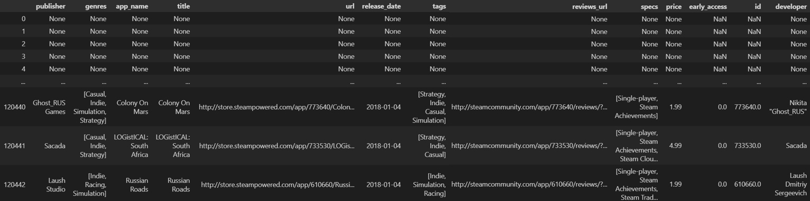
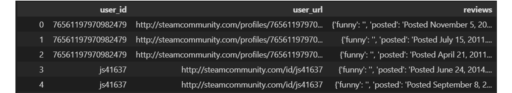
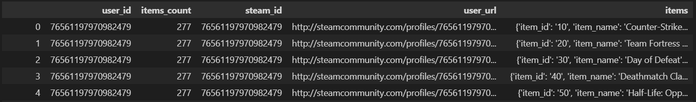
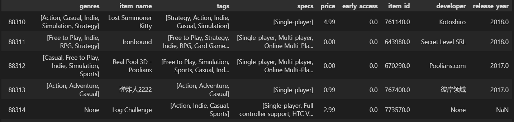

<h1 align='center'>
<b>Proyecto Individual 1 - Sistema de Recomendacion de STEAM</b>
</h1>

## Descripcion General


## Descripción de la Estructura de Datos

### Datos en bruto
Los datos empleados para la realizacion de este proyecto fueron extraidos del [Repositorio PI01 - Soy Henry](https://github.com/soyHenry/PI_ML_OPS/tree/FT). A continuacion se describen los archivos en bruto.

#### **Games**
<p align="center">
  
</p>

1. **publisher** - string <br> &emsp; Empresa publicadora del contenido
2. **genres** - list <br> &emsp; Genero del contenido
3. **app_name** - string <br> &emsp; Nombre del contenido
4. **title** - string <br> &emsp; Titulo del contenido
6. **url** - string <br> &emsp; URL de publicacion del contenido
7. **release_date** - string <br> &emsp; Fecha de lanzamiento
8. **tags** - list <br> &emsp; Etiquetas del contenido
9. **reviews_url** - string <br> &emsp; URL de las reviews del contenido
10. **specs** - list <br> &emsp; Especificaciones del contenido
11. **price** - string <br> &emsp; Precio del contenido
12. **early_access** - float <br> &emsp; Acceso temprano al contenido
13. **id** - float <br> &emsp; Identificador unico del contenido
14. **developer** - string <br> &emsp; Desarrollador del contenido

#### **Reviews**
<p align="center">
  
</p>

1. **user_id** - string <br> &emsp; Identificador unico del usuario
2. **user_url** - string <br> &emsp; URL del perfil del usuario
3. **reviews** - string <br> &emsp; Reviews del usuario en formato JSON. Contenia los siguientes datos: <br>

    - **funny** - string <br> 
    - **posted** - string <br> Fecha de publicacion
    - **last_edited** - string <br> &emsp; Ultima fecha de edicion
    - **item_id** - string <br> &emsp; Identificador unico del contenido
    - **helpful** - string <br> Indicador de si la reseña del usuario fue util
    - **recommend** - string <br> &emsp; Indicador de si el contenido fue recomendado por el usuario
    - **review** - string <br> &emsp; Reseña escrita por el usuario

#### **Items**
<p align="center">
  
</p>

1. **user_id** - string <br>
2. **items_count** - int <br>
3. **steam_id** - string <br>
4. **user_url** - string <br>
5. **items** - string <br>
Diccionario anidado con los items de cada usuario. Contenia los siguientes datos:

<p align="center">
  
</p>

- **item_id** - string <br>
- **item_name** - string <br>
- **playtime_forever** - float <br>
- **playtime_2weeks** - float <be>

### DataFrames finales

#### **Games**
<p align="center">
  
</p>

#### **Reviews**
<p align="center">
  
</p>

#### **Items**
<p align="center">
  
</p>

## Estructura del Proyecto

### Carpetas

- **Archivos API:** Contiene los archivos procesados y adaptados segun los requerimientos de cada funcion. Son los archivos que se cargan en las funciones del main.py y el main.ipynb
- **Archivos EDA:** Contiene los archivos resultantes del notebook EDA. Son los archivos que se cargan en el notebook Archivos_API.ipynb para crear los archivos especificos que se usaran en cada funcion.
- **Archivos ETL:** Contiene los archivos resultantes del notebook ETL. Son los archivos que se cargan al ejecutar el notebook EDA.ipynb

### Notebooks

- **Archivos_API:** En este notebook se realizo las transformaciones (merge, join y drop) necesarias para crear un archivo especifico para cada funcion que se requiere ejecutar.

- **EDA:** Contiene todo el Analisis Exploratorio de Datos del proyecto. Este incluye:
    - Manejo de nulos, vacios y duplicados
    - Variables estadisticas
    - Graficos univariables (histogramas, diagramas de torta, boxplot)
    - Analisis de sentimiento de los Reviews
    - Matrices de correlacion

- **ETL:** Contiene toda la parte de extraccion y transformacion de los datos. Esto incluye:
    - Desanidado de los archivos Reviews e Items
    - Normalizacion de nombre de las columnas
    - Cambio de tipo de dato
    - Eliminacion/adicion de columnas

- **main:** Contiene todas las funciones de la API de manera que se puedan ejecutar directamente en el notebook para control de resultados.

### Archivos adicionales

- **main.py:** Es el archivo conectado a la API y que se ejecuta desde el link de Render
- **requirements.txt:** Es el archivo donde se encuentran todas las librerias y versiones necesarias para ejecuar el proyecto desde un entorno virtual

## Instalacion

### Usando un entorno virtual

1. Clonar el repositorio: 
    ```
    git clone https://github.com/carocardenas0699/PI-Machine-Learning.git
    ```
2. Crear un entorno virtual: 
    ```
    python -m venv venv
    ```
3. Activar el entorno virtual:
   - Windows: 
        ```
        venv\Scripts\activate
        ```
   - macOS/Linux: 
        ```
        source venv/bin/activate
        ```
4. Instalar las dependencias: 
    ```
    pip install -r requirements.txt
    ```

### Librerias Instaladas

- matplotlib
- pandas
- numpy
- scikit-learn
- pyarrow
- nltk
- re
- seaborn
- json
- ast
- jinja2
- fastapi

## Uso y Ejecucion
A continuacion se presenta el orden de ejecucion del proyecto. Si se desea realizar la ejecucion desde el notebook de ETL se debe descarga los dataset originales en formato json desde la [fuente](https://github.com/soyHenry/PI_ML_OPS/tree/FT), de lo contrario se puede comenzar directamente desde el notebook EDA
1. ETL.ipynb
2. EDA.ipynb
3. Archivos_API.ipynb
4. main.py (o main.ipynb)

## Metodologia

## Resultados

Link Deployment: https://pi-machine-learning.onrender.com/

## Autor

Carolina Cardenas - Contacto: [LinkedIn](https://www.linkedin.com/in/carolina-cardenas-gutierrez-b3b25114b/)
